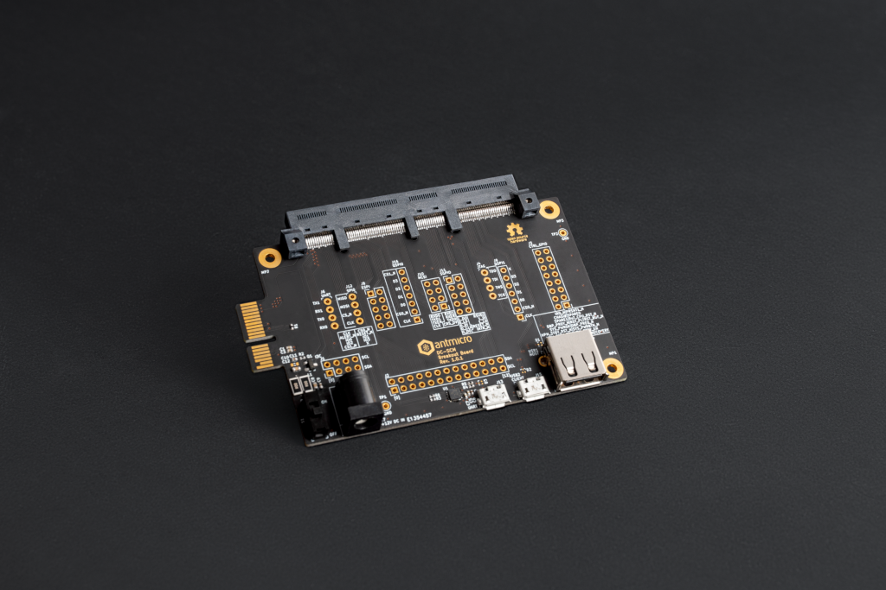

=========================================================
Data Center Secure Control Module (DC-SCM) Breakout Board
=========================================================

Copyright (c) 2020-2022 `Antmicro <https://www.antmicro.com>`_

.. image:: https://img.shields.io/badge/View%20on-Antmicro%20Open%20Source%20Portal-332d37?style=flat-square
      :target: https://opensource.antmicro.com/projects/dc-scm-breakout-board

   

Overview
========

This repository contains open hardware design files for a breakout board exposing IO interfaces offered by 
Data Center Secure Control Modules (DC-SCM).
This board aids software development and allows for initial testing of the DC-SCM before installing it in a server.
This board is compatible with Antmicro's `Experimental DC-SCM card <https://github.com/antmicro/artix-dc-scm>`_ based on Xilinx Artix-7 FPGA.

Repository structure:
---------------------

The main repository directory contains the KiCad PCB project files, LICENSE and README.
The remaining files are stored in the following directories:

* ``img`` - contains graphics for this README
* ``lib`` - contains KiCad component libraries for the project
* ``doc`` - contains additional documentation generated from the project files

The design files were prepared in KiCad 5.1.9.

Key features
============

* Expansion connector compatible with 168-pin DC-SCM horizontal cards
* USB 2.0 (type-A) connector for testing USB host controllers
* Micro USB 2.0 connector for testing USB client controllers
* Micro USB 2.0 connector with serial console break-routed from one of the DC-SCM UART ports
* PCIe x1 edge connector
* DC barrel jack
* Pin headers exposing low speed IO interfaces offered by DC-SCM modules (I2C, UART, SPI, QSPI etc.)

License
=======

`Apache-2.0 <LICENSE>`_
